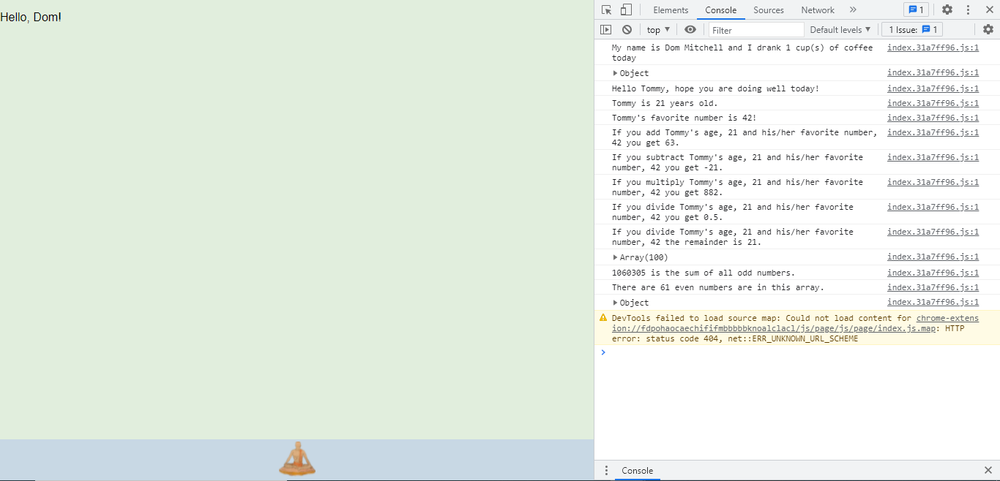

# VariablesJS

## Assignment

The goal of this assignment was to display knowledge of using JavaScript/Typescript to interact with the user and do console logging.

The above is a screen capture of the webpage that I created and it displays the console log.

A link to the webpage that I made can be found in the About section of this repository or below.

https://variablesjs-dommitchell.netlify.app/
